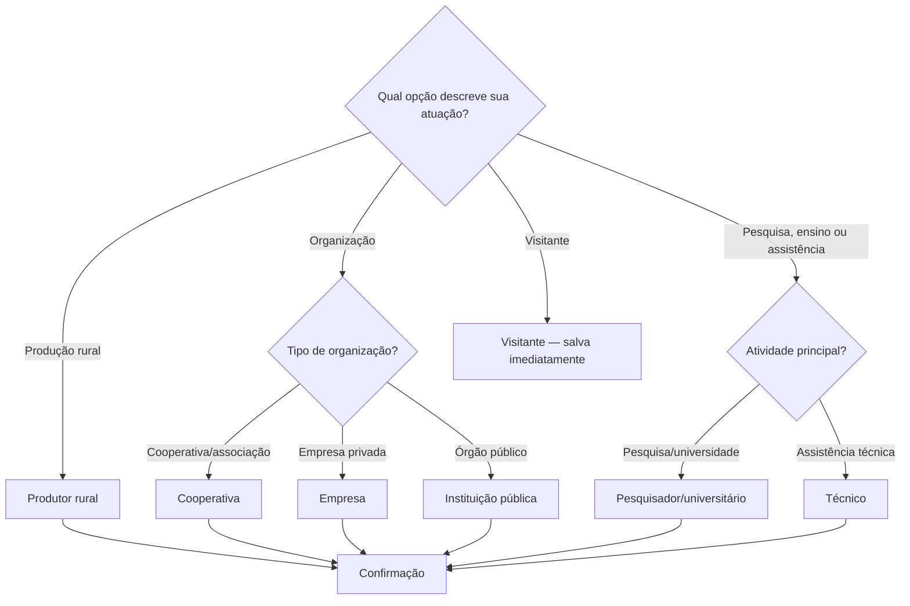

# Relatório — Classificação de perfil do usuário

## 1. Objetivo

Implementar no primeiro acesso uma classificação local por árvore de decisão, com sete perfis, entrada direta como Visitante, reclassificação posterior e acesso centralizado ao resultado. O perfil é uma preferência do navegador e não representa autenticação ou autorização.

## 2. Arquitetura da solução

A solução foi integrada ao topo da SPA por `UserProfileProvider`, sem alterar o contrato HTTP de `/perguntar` nem adicionar estado global externo. As responsabilidades foram divididas entre tipos, árvore declarativa e transições puras, validação/persistência, store do navegador, contexto React e Dialog visual. A inicialização lê `localStorage` de forma síncrona no initializer do estado, evitando a abertura breve do modal quando já existe registro válido.

`useUserProfile()` oferece o registro reativo e a ação de reclassificação a componentes React. `getUserProfile()` e `setUserProfile()` são a API imperativa central. Mudanças na mesma aba usam um evento local; mudanças em outras abas usam o evento `storage`.

## 3. Arquivos alterados

- `src/main.tsx`: instala o provider no ponto raiz.
- `src/app/App.tsx`: mostra o perfil atual e a ação “Alterar meu perfil”.
- `src/app/components/ui/dialog.tsx`: permite ocultar o fechamento visual no fluxo obrigatório e traduz seu nome acessível.
- `src/app/user-profile/types.ts`: perfis, labels e schema compartilhado.
- `src/app/user-profile/decisionTree.ts`: definição e transições da árvore.
- `src/app/user-profile/storage.ts`: criação, parsing, leitura e escrita defensivos.
- `src/app/user-profile/profileStore.ts`: API central, fallback em memória e eventos.
- `src/app/user-profile/UserProfileContext.tsx`: inicialização, sincronização e controle do modal.
- `src/app/user-profile/UserProfileModal.tsx`: perguntas, confirmação, retorno, Visitante e acessibilidade.
- `src/app/user-profile/*.test.ts`: testes unitários da árvore e persistência.
- `scripts/user-profile-browser-check.mjs`: verificação E2E real via Chrome DevTools.
- `package.json`, `package-lock.json`, `tsconfig.json` e `tsconfig.app.json`: scripts e checagem do grafo ativo.
- `.agents/skills/frontend-specialist/`: referência da funcionalidade e atualização da stack/testes.

## 4. Árvore de decisão

Uma pergunta é exibida por vez. O histórico permite voltar; um resultado pendente é descartado antes de editar a resposta. Nenhuma classificação parcial é persistida.

## 5. Persistência

- Chave: `user_profile`.
- Schema: `{ version: 1, profile, classifiedAt, classificationMethod }`.
- Métodos: `decision_tree` para seis perfis e `visitor` para Visitante.
- Validação: versão exata, perfil enumerado, data válida, método permitido e coerência entre Visitante/método.
- Erros: JSON inválido, schema incompatível e falha de leitura produzem ausência de perfil; falha de escrita preserva o registro em memória e gera aviso seguro na interface.
- Primeiro acesso ou dado inválido: modal obrigatório.
- Acessos posteriores com registro válido: aplicação segue sem modal.

Não são armazenadas respostas intermediárias nem informações pessoais.

## 6. Interface

O modal reutiliza Radix Dialog e a identidade emerald/slate do projeto. Possui título e descrição acessíveis, foco reposicionado no heading a cada etapa, opções com foco visível, navegação por teclado, anúncio de mudanças, rolagem interna e limite por `100dvh`. No primeiro acesso, Escape, clique externo e botão de fechar não dispensam o fluxo; Visitante é a saída explícita. O teste móvel usou 375 × 667 sem overflow horizontal.

## 7. Alteração de perfil

O painel de navegação exibe o perfil atual e “Alterar meu perfil”. A reclassificação abre a mesma árvore; o fechamento voluntário preserva o registro anterior. A confirmação substitui o registro e atualiza a tela sem recarregar.

## 8. Testes executados

- Etapa vermelha: `npm.cmd test` — falhou como esperado com 2 módulos ainda inexistentes.
- Unitários finais: `npm.cmd test` — 15 aprovados, 0 falhas.
- Tipos: `npm.cmd run type-check` — aprovado para o grafo ativo.
- Build: `npm.cmd run build` — aprovado; 1.991 módulos transformados.
- Navegador: `npm.cmd run test:e2e` — 6 cenários aprovados no Chrome headless: primeiro acesso/confirmar, segundo acesso, voltar e reclassificar, Visitante, dado corrompido e viewport 375 × 667. Também foram verificados foco inicial/entre etapas, cancelamento da reclassificação, bloqueio por Escape e ausência de persistência antes da confirmação.
- Lint: não executado porque o repositório não possui ferramenta ou script de lint.

A primeira tentativa E2E falhou no harness por abrir `about:blank`; a segunda não carregou porque o cache do Chrome dentro do workspace bloqueou o watcher do Vite. O harness foi corrigido para navegar explicitamente e a validação final usou `vite preview`, passando integralmente.

## 9. Critérios de aceite

Concluídos: abertura condicional, árvore real, sete perfis, Visitante direto, retorno, resultados corretos, confirmação dos seis perfis, persistência/validação, recarga, responsividade móvel, identidade visual, recursos de acessibilidade, API central, reclassificação reativa, testes unitários em TDD, E2E real, type-check, build, documentação e atualização da skill.

Pendente: lint automatizado, pois não existe infraestrutura declarada. Não foi executado teste com leitor de tela humano nem matriz multibrowser.

## 10. Limitações

- Sem `localStorage`, o perfil dura apenas na memória da aba atual; a interface informa essa condição.
- A classificação ainda não personaliza conteúdo, conforme o escopo.
- O harness E2E é específico do fluxo de perfil e pressupõe Vite/Chrome DevTools já iniciados.
- O validador `quick_validate.py` da skill não pôde concluir porque o Python disponível não possui o módulo `yaml`; a estrutura e os links da atualização foram inspecionados diretamente.
- `npm install` reportou 9 vulnerabilidades no grafo declarado (3 moderadas e 6 altas); nenhuma correção automática potencialmente incompatível foi aplicada.
- Componentes UI vendorizados e desconectados importam dependências não declaradas. Por isso o type-check usa o grafo ativo, sem mascarar erros nos arquivos realmente importados pela aplicação.
